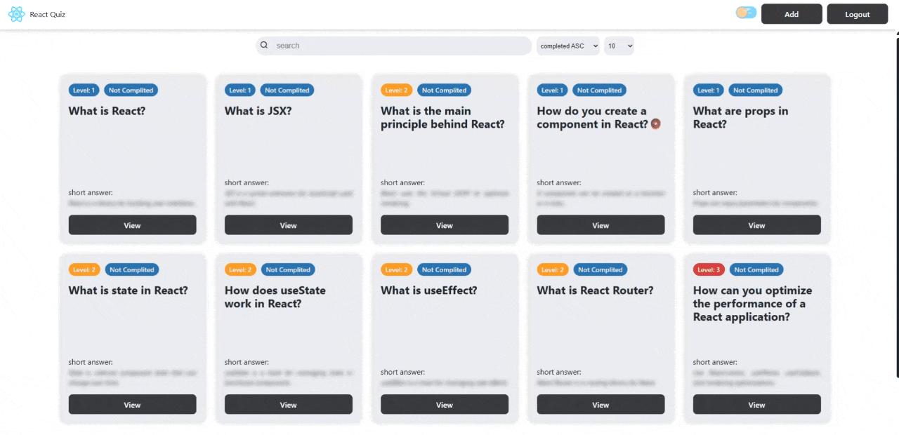

# React Quiz App

An interactive full-stack React quiz application where users can test their React knowledge, manage quiz questions, and personalize their experience with theme switching.



## 🚀 Live Demo

**Live Site:** https://react-quiz-app-8gve.onrender.com/

> ⚠️ This project is hosted on a free server. If the application has been inactive, the backend may take a few seconds to wake up. Please wait a moment and the app will load automatically.

---

## ✨ Features

### 🔐 Authentication

- User registration
- User login
- Protected routes
- Secure user sessions

### 📝 Quiz System

- React-focused quiz questions
- Instant answer
- Interactive quiz experience

### 🛠️ Question Management (CRUD)

Authenticated users can:

- Create new question cards
- Edit existing questions
- Delete questions
- Manage quiz content dynamically

### 🎨 Theme Customization

- Light mode
- Dark mode
- Seamless theme switching

### 📱 Responsive Design

- Mobile-friendly layout
- Clean and modern UI
- Optimized user experience across devices

---

## 🧰 Tech Stack

### Frontend

- React
- React Router
- Context API
- CSS

### Backend

- Node.js

### Database

- json-server

---

## 📦 Installation

### Clone the repository

```bash
git clone https://github.com/Mary-Varf/react-quiz.git
```

````

### Navigate to the project folder

```bash
cd react-quiz
```

### Install dependencies

```bash
npm install
```

### Start the development and server

```bash
npm run start app
```

---

## ⚙️ Environment Variables

Create a `.env` file and add the required variables:

```env
VITE_SERVER_URL = http://localhost:8802
```

Adjust the values according to your local setup.

---

## 📂 Project Structure

```text
src/
├── components/
├── pages/
├── context/
├── hooks/
├── services/
├── assets/
└── App.jsx
```

---

## 🎯 Future Improvements

- Quiz categories
- Difficulty levels
- Leaderboards
- User statistics dashboard
- Question search and filtering
- Timed quizzes

---

## 📚 Learning Outcomes

This project helped me improve my skills in:

- React development
- State management
- Authentication and authorization
- CRUD operations
- REST API integration
- Responsive design
- Full-stack deployment

---

## 👩‍💻 Author

**Mary Varf**

GitHub: https://github.com/Mary-Varf

````
